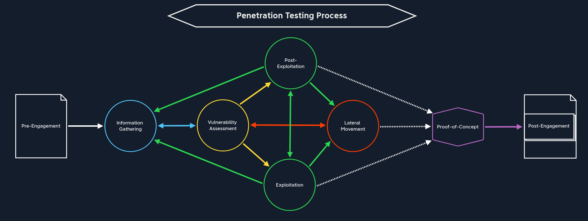

# Pentesting process

<figure><figcaption></figcaption></figure>

## 1. Pre-Engagement

Contratctual documents are drawn up.

-> Next part : Information Gathering

## 2. Information Gathering

Get an overview of the target web application(s) or network before proceeding further.

-> Next part : Vulnerability Assessment

## 3. Vulnerability Assessment

Found to identify potential weaknesses and gaps

Vulnerability Assessment is divided into two areas :
- An approach to scan for known vulnerabilities using automated tools
- Analyzing for potential vulnerabilities through the information found

-> Next part : Exploitation, Post-Exploitation, Lateral Movement or returning to Information Gathering

## 4. Exploitation

We do not have interactions with target systems yet but we have identified gap(s)

Exploitation is divided into two areas :
- General network protocols 
- Web exploitation

-> Next part : Information Gathering, Post-Exploitation, Lateral Movement, POC

## 5. Post-Exploitation

We already have interactions with target systems and we try to perform privilege escalation :

- Linux Privilege Escalation
- Windows Privilege Escalation

-> Next part : Information Gathering / Pillaging , Exploitation , Lateral Movement , POC

Pillaging = get an overview of the inner workings of the exploited system

## 6. Lateral Movement

We already have interactions with target systems and we move from the already exploited system through the network and attack other systems.

-> Next part : Vulnerability Assessment	, Information Gathering / Pillaging	, Proof-of-Concept	

## 7. POC

Summarize the information and steps we have collected, maybe automate some steps, so the company could reproduce vulnerabilities.

-> Next part : Post-Engagement

## 8. Post-Engagement

Cleaning up the systems we exploit by remove all content that we have transferred to the systems during our penetration test. Note down any system changes, successful exploitation attempts, captured credentials, and uploaded files in the appendices of our report. 

-> Next part : Documentation & Reporting