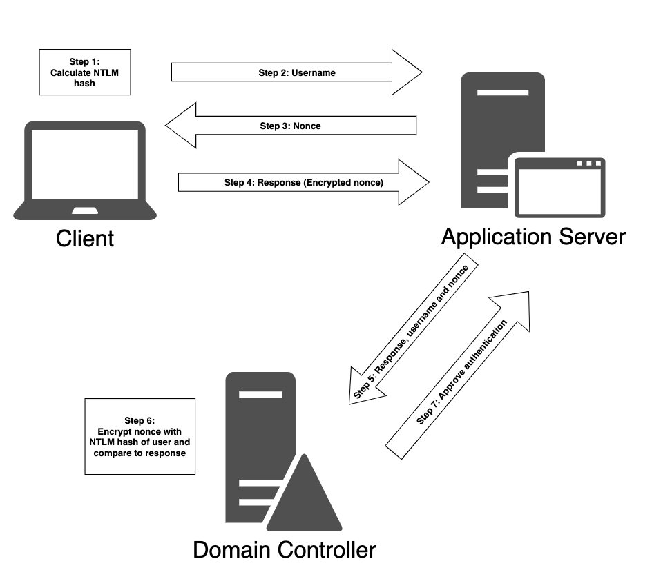

# NTLM vs Kerberos

## NTLM

<figure><figcaption></figcaption></figure>

NTLM est utilisé quand un utilisateur souhaite se connecter directement à un serveur sans connaître son hostname (connection via l'adresse IP ou en utilisant un hostname qui n'est pas connu de l'Active Directory integrated-DNS Server).

## Kerberos

La différence majeure avec NTLM est que le client n'interagit pas avec le serveur pour s'authentifier mais avec le KDC (Key Distribution Center).

Le rôle de KDC est souvent porté par le Domain Controller.

<figure><figcaption></figcaption></figure>

## Step 1 = AS-REQ

Contenu de l'AS-REQ :

* Nom d'utilisateur
* Le timestamp chiffré via le hash du mdp de l'utilisateur

## Step 2 = AS-REP

Si le hash correspond à celui de l'utilisateur dans la base ntds.dit alors OK

Contenu de l'AS-REP :&#x20;

* TGT chiffré avec le NTLM du mdp du compte krbtgt
* Session key chiffrée avec le hash du mdp de l'utilisateur

## Step 3 = TGS-REQ

Contenu du TGS-REQ :&#x20;

* Nom d'utilisateur chiffré par la Session Key
* Le timestamp chiffré par la Session Key
* Le nom de la ressource souhaité
* Le TGT chiffré

## Step 4 = TGS-REP

Actions de vérifications effectuées par le KDC :

1. Le KDC utilise le mdp du compte KRBTGT pour déchiffré le TGT
2. La Session Key étant présente dans le TGT déchiffré, elle est extraite pour déchiffrer le nom d'utilisateur et le timestamp
3. Le KDC verifie ensuite
   1. Que le TGT présente un timestamp valide
   2. Que le nom d'utilisateur présent dans TGS-REQ correspond au nom d'utilisateur présent dans le TGT
   3. Que l'adresse IP du client corresponde à l'adresse IP présente dans le TGT

Contenu du TGS-REP :&#x20;

* Le nom du service pour lequel l'accès a été accordé chiffré par la Session Key originale utilisée par le TGT
* La session Key à utiliser entre le client et le service chiffré par la Session Key originale utilisée par le TGT
* Le service ticket (TS) qui contient le nom d'utilisateur, ses groupes d'appartenance et une nouvelle session Key. Le TS est chiffré par le Hash du compte de service associé au service en question

## Step 5 = AP-REQ

Contenu de l'AP-REQ :&#x20;

* Nom d'utilisateur chiffré par la nouvelle Session key associée au TS
* Timestamp chiffré par la nouvelle Session key associée au TS
* Service ticket (TS)

## Step 6 = AP-REP

Actions de vérifications effectuées par l'application :

1. Déchiffrement du service ticket avec le hash du mot de passe du compte de service
2. Extraction du nom d'utilisateur et de la Session Key présente dans le TS
3. Déchiffrement du nom d'utilisateur présent dans l'AP-REQ
4. Si le nom d'utilisateur dans le TS matche celui de l'AP-REQ alors l'authentification est OK
5. Vérification des groupes d'appartenance de l'utilisateur pour lui attribuer les bonnes permissions
