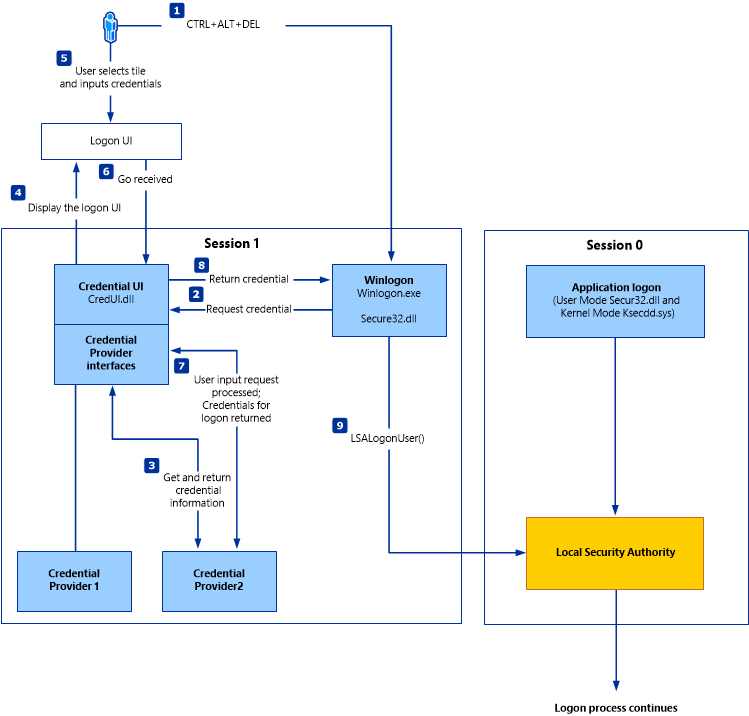

# Credential storage

## Linux

### /etc/shadow

/etc/shadow : password stored as hashes

$2a$->Blowfish
$5$->SHA-256
$6$->SHA-512
$sha1$->SHA1crypt
$y$->Yescrypt
$gy$->Gost-yescrypt
$7$->Scrypt	

/etc/shadow file can only be read by the user root

### /etc/passwd

cat /etc/passwd
htb-student:x:1000:1000:,,,:/home/htb-student:/bin/bash

The x in the password field indicates that the encrypted password is in the /etc/shadow file

Therefore, an empty field means that we can log in with the username without entering a password.

## Windows

## Authentication process

1. WinLogon

Winlogon is a trusted process responsible for managing security-related user interactions. These include:
- Launching LogonUI to enter passwords at login
- Changing passwords
- Locking and unlocking the workstation

After Winlogon obtains a user name and password from the credential providers, it calls LSASS to authenticate the user attempting to log in.

2. LSASS

LSASS is the vault for Windows-based operating systems.

This service is responsible for the local system security policy, user authentication, and sending security audit logs to the Event log.

3. SAM 

a) Local/Non-domain joined

The Security Account Manager (SAM) is a database file in Windows operating systems that stores users' passwords.

User passwords are stored in a hash format in a registry structure : LM or NTLM Hash

File Location : %SystemRoot%/system32/config/SAM
Mounted on : HKLM/SAM. 
SYSTEM level permissions are required to view it.

b) System has been joined to a domain

Domain Controller (DC) must validate the credentials from the Active Directory database (ntds.dit)
File Location : %SystemRoot%\ntds.dit

-> syskey.exe partially encrypts hard disk copy of the SAM file.

## Credential Manager

Credential Manager is a feature that allows users to save the credentials they use.
Credentials are encrypted and stored at the following location :

File Location : PS C:\Users\[Username]\AppData\Local\Microsoft\[Vault/Credentials]\

## NTDS

Windows systems are very commonly joined to a Windows domain.
It makes it easier for admins to manage all the systems owned by their respective organizations (centralized management). 
--> In these cases, Windows systems will send all logon requests to Domain Controllers that belong to the same Active Directory forest. 
Each Domain Controller hosts a file called NTDS.dit that is kept synchronized across all Domain Controllers (expect RODC)

RODC = Read-Only Domain Controllers. 

NTDS.dit is a database file that stores the data in Active Directory, including but not limited to:

User accounts (username & password hash)
Group accounts
Computer accounts
Group policy objects