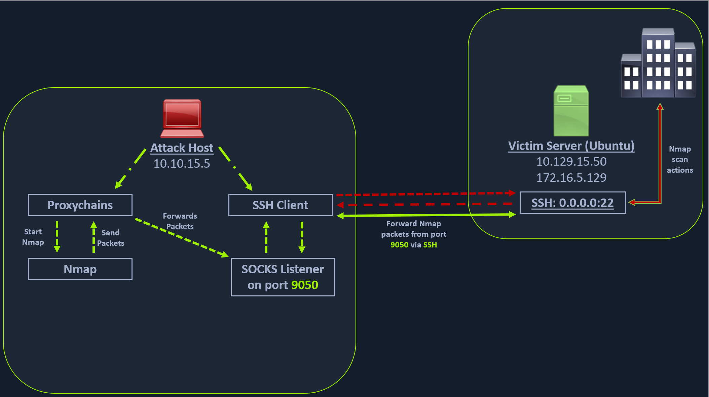

# Dynamic Port Forwarding with SSH and SOCKS Tunneling

Scanning the Pivot Target :
nmap -sT -p22,3306 $TARGET --stats-every=5s
nmap -sT -p22,3306 -iL hosts.lst --stats-every=5s

PORT     STATE  SERVICE
22/tcp   open   ssh
3306/tcp closed mysql

Executing the Local Port Forward :
ssh -L 1234:localhost:3306 ubuntu@$TARGET

Confirming Port Forward with Netstat :
netstat -antp | grep 1234

Confirming Port Forward with Nmap :
nmap -v -sV -p1234 localhost

PORT     STATE SERVICE VERSION
1234/tcp open  mysql   MySQL 8.0.28-0ubuntu0.20.04.3

Forwarding Multiple Ports :
ssh -L 1234:localhost:3306 -L 8080:localhost:80 ubuntu@$TARGET

# Setting up to Pivot

## SSH tunneling over SOCKS proxy

->  allow an external entity to bypass the firewall

SOCKS4 : UDP no authentication
SOCKS5 : TCP with authentication

Enabling Dynamic Port Forwarding with SSH :
ssh -D 9050 ubuntu@$TARGET

# Configure and use NMAP with proxychains

Checking Proxychains conf :
tail -4 /etc/proxychains.conf
socks4 	127.0.0.1 9050

Using Nmap with Proxychains
proxychains nmap -v -sn 172.16.5.1-200
proxychains nmap -v -sn $TARGET_AFTER_PIVOT

SOCKS tunneling = the fact of packing nmap data inside proxychains
-> only full TCP connect scan
-> host-alive checks may not work against Windows targets

## Using Metasploit with Proxychains

proxychains msfconsole
search rdp_scanner
msf6 auxiliary(scanner/rdp/rdp_scanner) > set rhosts 172.16.5.19
run

[*] 172.16.5.19:3389      - Detected RDP on 172.16.5.19:3389      (name:DC01) (domain:DC01) (domain_fqdn:DC01) (server_fqdn:DC01) (os_version:10.0.17763) (Requires NLA: No)
[*] 172.16.5.19:3389      - Scanned 1 of 1 hosts (100% complete)

# Using xfreerdp with Proxychains

proxychains xfreerdp /v:$TARGET /u:user /p:pass

## LAB

ssh ubuntu@$TARGET
HTB_@cademy_stdnt!

ubuntu@WEB01:~$ ifconfig
ens192: flags=4163<UP,BROADCAST,RUNNING,MULTICAST>  mtu 1500
        inet 10.129.242.158  netmask 255.255.0.0  broadcast 10.129.255.255
        inet6 fe80::250:56ff:feb9:65f3  prefixlen 64  scopeid 0x20<link>
        inet6 dead:beef::250:56ff:feb9:65f3  prefixlen 64  scopeid 0x0<global>
        ether 00:50:56:b9:65:f3  txqueuelen 1000  (Ethernet)
        RX packets 528  bytes 38258 (38.2 KB)
        RX errors 0  dropped 0  overruns 0  frame 0
        TX packets 99  bytes 12117 (12.1 KB)
        TX errors 0  dropped 0 overruns 0  carrier 0  collisions 0

ens224: flags=4163<UP,BROADCAST,RUNNING,MULTICAST>  mtu 1500
        inet 172.16.5.129  netmask 255.255.254.0  broadcast 172.16.5.255
        inet6 fe80::250:56ff:feb9:519f  prefixlen 64  scopeid 0x20<link>
        ether 00:50:56:b9:51:9f  txqueuelen 1000  (Ethernet)
        RX packets 59  bytes 5472 (5.4 KB)
        RX errors 0  dropped 7  overruns 0  frame 0
        TX packets 39  bytes 2813 (2.8 KB)
        TX errors 0  dropped 0 overruns 0  carrier 0  collisions 0

lo: flags=73<UP,LOOPBACK,RUNNING>  mtu 65536
        inet 127.0.0.1  netmask 255.0.0.0
        inet6 ::1  prefixlen 128  scopeid 0x10<host>
        loop  txqueuelen 1000  (Local Loopback)
        RX packets 223  bytes 17704 (17.7 KB)
        RX errors 0  dropped 0  overruns 0  frame 0
        TX packets 223  bytes 17704 (17.7 KB)
        TX errors 0  dropped 0 overruns 0  carrier 0  collisions 0

tail -4 /etc/proxychains.conf
socks4 	127.0.0.1 9050

proxychains msfconsole
search rdp_scanner
msf6 auxiliary(scanner/rdp/rdp_scanner) > set rhosts 172.16.5.19
run

ssh -D 9050 ubuntu@$TARGET
proxychains xfreerdp /v:$TARGET_AFTER_PIVOT /u:victor /p:pass@123
