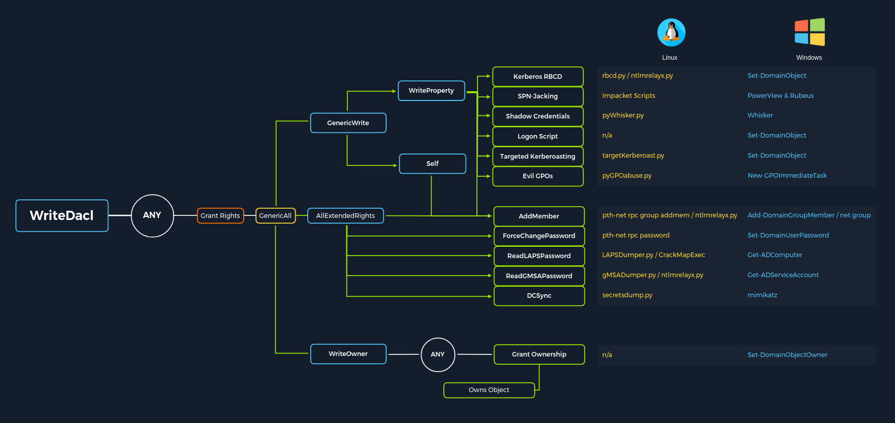

# ACL

Access Control Entities (ACEs) : Settings into an ACL (users,groups,processes)

Every object as an ACL an multiple ACEs

- Discretionary Access Control List (DACL) - defines which security principals are granted or denied access to an object.
- System Access Control Lists (SACL) - allow administrators to log access attempts made to secured objects.

If no DACL on object, access to the object are granted full rights

Types of ACEs :
- Access denied ACE
- Access allowed ACE
- System audit ACE

Use 4 components :
- (SID) of the user/group
- A flag denoting the type of ACE (access denied, allowed, or system audit ACE)
- A set of flags that specify whether or not child containers/objects can inherit the given ACE 
- An access mask which is a 32-bit value that defines the rights granted to an object

## Abusing

ForceChangePassword abused with Set-DomainUserPassword
Add Members abused with Add-DomainGroupMember
GenericAll abused with Set-DomainUserPassword or Add-DomainGroupMember
GenericWrite abused with Set-DomainObject
WriteOwner abused with Set-DomainObjectOwner
WriteDACL abused with Add-DomainObjectACL
AllExtendedRights abused with Set-DomainUserPassword or Add-DomainGroupMember
Addself abused with Add-DomainGroupMember

- ForceChangePassword - gives us the right to reset a user's password without first knowing their password 
- GenericWrite - gives us the right to write to any non-protected attribute on an object. If we have this access over a user, we could assign them an SPN and perform a Kerberoasting attack 
- AddSelf - shows security groups that a user can add themselves to.
- GenericAll - this grants us full control over a target object (user or group)

--> ACL_attacks_graphic