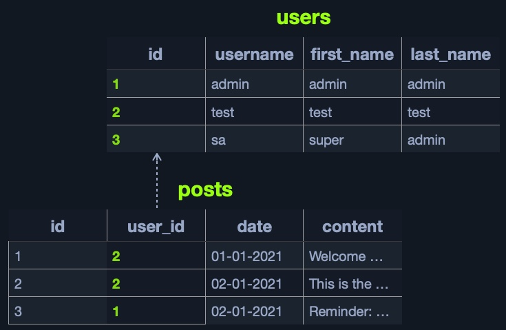

# Intro

Tier I : Website or GUI program
Tier II : API calls or Database Management

## Relational Databases

-> very fast and reliable for big datasets with clear structure and design and efficient data management

The most common example of relational databases is MySQL

## Non-relational Databases (NoSQL)

-> very scalable and flexible : Best choice when dealing with datasets that are not very well defined and structured

The most common example of a NoSQL database is MongoDB.
